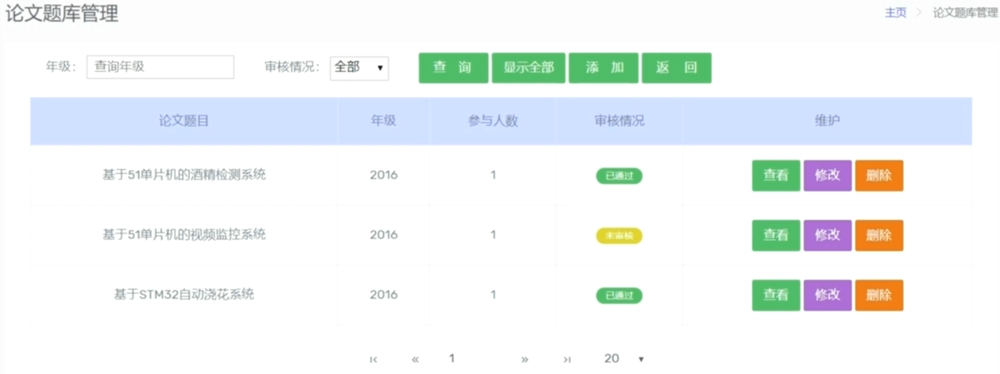

<h1>Graduation project selection system</h1>

<strong>Graduation project selection system实现了指导老师在网站上出题，学生在网站上选题。本系统涉及用户管理、选题审核、在线选题、历史记录查询、数据库存储等功能。本系统以Django开发。前端主要使用了Bootstrap、jQuery，后端使用路由分发实现了不同的用户访问，包括系统管理员、系主任、指导老师和学生四个角色。</strong>

> [在线地址](http://gpss.mileschen.cn/)

## 功能
### 通用功能
- 登录、退出
- 记住密码、验证码
- 个人信息维护
- 历届选题信息查看
### 管理员
- 对系主任增加、修改、冻结、删除
- 删除、冻结系主任将会删除系内容所的老师与学生都会被冻结
### 系主任
- 上传CSV文件批量导入学生和老师信息
- 支持对系内老师和学生基本信息修改如重置密码
- 老师发布的选题信息审核，审核过了学生才能选题
- 对系内老师与学生账号冻结、解冻、删除操作
### 老师
- 发布选题信息
- 对学生选题信息审核

### 学生
- 学生拥有四个志愿选题
- 四个志愿权重从高到底，当第一志愿未被审核，其他的就不能审核。
- 四个志愿全挂可以重新选题

## 快速上手
1. 环境安装
> `pip install -r requirements.txt`
2. MySQL数据库初始化
- 创建数据库
	
	> CREATE DATABASE `gpss`;
- 修改item/setting.py 将DATABASES配置成你的的数据库 
- 创建数据表
	
	> python manage.py migrate
3. 启动Django
`python manage.py runserver`

## 效果

## 数据库表
### 用户信息表

### 系表

### 论文出题表

### 论文选题表

## 权限管理
### 用户管理权限

管理员有权在建立数据库时初始化数据库脚本的创建。管理员登录后，可以维护自己的信息。同时，他可以为不同系主任分配编号并维护系主任信息。系主任登录系统后可以维护自己的信息，并为系内的指导老师和学生创建系统用户。系用户只能查看所属系内的的相关信息。本系统共有四个角色，因此系统在实施过程中会根据用户角色来判断其拥有的权限，根据数据库存储的类型判断。
(1)系统管理(UserTable.user_type = 3)
(2)系主任(UserTable.user_type = 2)
(3)指导老师(UserTable.user_type = 1)
(4)学生(UserTable.user_type = 0)

### 论文题目审核流程
老师拟定毕业论文的题目并提交系主任审核，系主任审核并评估以供学生选择，学生可以选择系主任批准的题目。学生可以根据自己的兴趣、特长和实际情况选择第一，第二，第三和其他四名志愿者，并等待老师的审核。

## 待办
- [ ] 重构代码；
- [ ] 将不同权限的登录窗口合并为一个；
- [ ] 添加邮箱验证；
- [ ] 登录成功页优化；

## 贡献
欢迎PRs！如果你想为这个项目做贡献，你可以提交pr或issue，[待办](#待办)中有一些可以扩展的功能。我很高兴看到更多的人参与改进并优化它。